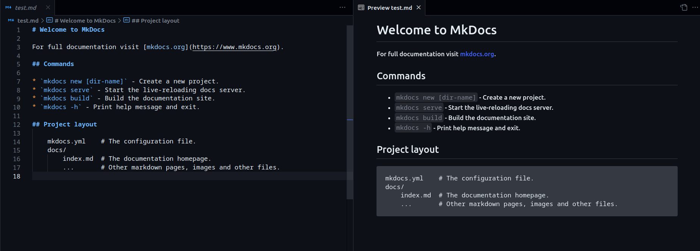

# Ajouter du contenu dans un fichier markdown

## Syntaxe markdown

Le markdown est un language de balisage crée en 2004 par John Gruber et Aaron Swartz.

Ce dernier a comme objectif la simplicité de lecture et la facilité de modification, ce qui la rendu très populaire et est utilisé
sur de nombreux sites de bloggings, de forum (coucou [Stackoverflow](https://stackoverflow.com/)) ou même de service de messagerie en ligne tel que Discord.

Il est possible, à l'aide de VSCode de visualiser le contenu d'un fichier markdown à l'aide du raccourci CTRL-MAJ-V d'ouvrir un onglet de prévisualisation afin d'avoir une idée de à quoi ressemblera la page une fois déployée sur le site.

<figure markdown>
  { width="300" }
  <figcaption>Image caption</figcaption>
</figure>